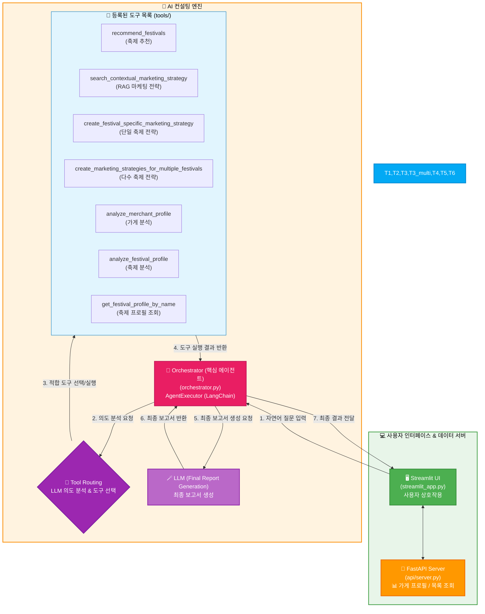
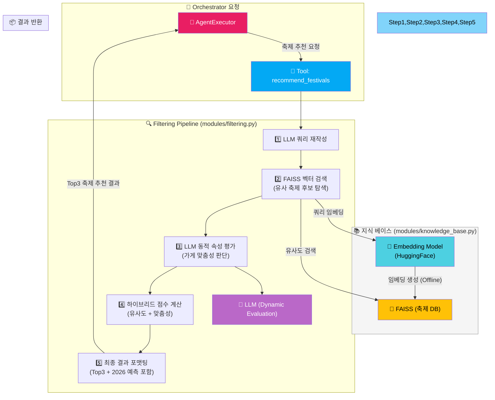
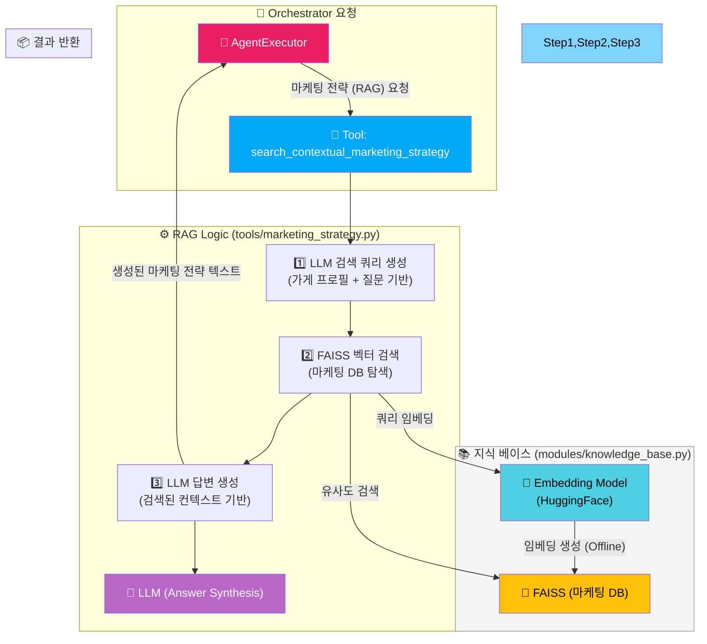
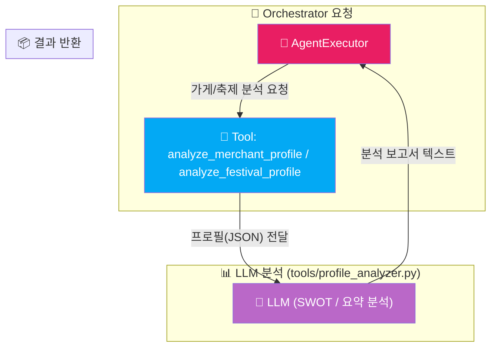

# 🎉 MarketSync (마켓싱크)

### Agentic RAG 기반 소상공인 맞춤형 지역 축제 추천 & 마케팅 AI 컨설턴트

신한카드 빅데이터와 전국 축제 정보를 통합 분석하여, **AI 에이전트**가 가게별로 참여할 만한 지역 축제를 추천하고 최적의 마케팅 전략 보고서를 자동 생성합니다. 

------------------------------------------------------------------------

## 🧭 프로젝트 개요

MarketSync는 **Streamlit 웹 인터페이스, FastAPI 데이터 서버, LangChain 에이전트**를 결합하여 소상공인을 위한 AI 컨설팅 서비스를 제공합니다. 사용자는 자신의 가게를 선택하여 상세 프로필과 분석 그래프를 확인한 뒤, "10월에 열리는 축제 추천해줘", "추천된 축제들의 마케팅 전략 알려줘" 와 같은 자연어 질문을 통해 맞춤형 컨설팅을 받을 수 있습니다.

핵심 아키텍처는 **Agentic RAG**입니다. **AI 에이전트**(`Orchestrator`)는 사용자의 질문과 가게의 상세 프로필(JSON)을 바탕으로 상황에 맞는 **도구**(Tool)를 자율적으로 선택하고, 사용자의 질문에 따라 필요하다면 여러 도구를 순차적으로 호출하여 최종 컨설팅 보고서를 생성합니다.

------------------------------------------------------------------------

## 🌐 서비스 데모 URL

**[https://huggingface.co/spaces/hyeonjoo/MarketSync](https://huggingface.co/spaces/hyeonjoo/MarketSync)**

이 앱은 **Hugging Face Spaces** (무료 등급, 16GB RAM)를 이용해 배포되었습니다.

본 프로젝트의 대용량 AI 임베딩 모델(`BGE-m3-ko`)을 실행하기 위해 넉넉한 RAM이 필요했습니다. (대회에서 권장된 Streamlit Cloud는 1GB RAM 제한으로 메모리 오류가 발생하여 Hugging Face로 최종 배포했습니다.)

*참고: 최초 접속 시 또는 비활성화 상태에서 재접속 시, Space가 빌드되거나 모델을 로드하는 데 1~2분 정도 소요될 수 있습니다.*


### 💡 GitHub 코드와 배포 버전의 차이

Hugging Face 배포 버전은 배포 편의성을 위해, GitHub 원본 코드의 FastAPI (`api/server.py`) 데이터 처리 로직을 `streamlit_app.py`에 **직접 통합**한 '일체형' 구조입니다.

(원본의 FastAPI 서버는 UI와 데이터 처리를 분리하여 메모리 효율성을 높이기 위한 설계였습니다.)

------------------------------------------------------------------------

## 📜 상세 설명서

**[ (여기를 클릭) Synape_상세설명서.pdf 다운로드/보기 ](Synape_상세설명서.pdf)**

[](Synape_상세설명서.pdf)

------------------------------------------------------------------------

## 🚀 로컬 개발 환경 구성 방법

### 1️⃣ 사전 준비

* Python 3.11 이상 설치
* `uv` (Python 패키지 설치 도구) 설치 (`pip install uv`)
* Google API Key 발급 (Gemini 모델 사용)

### 2️⃣ FastAPI 서버 실행

FastAPI 서버는 가맹점 데이터(`final_df.csv`)를 로드하고, `/profile` (가게 상세 정보), `/merchants` (가게 목록) 엔드포인트를 제공합니다.

```bash
# 1. 프로젝트 루트 폴더로 이동
cd C:(다운받은 폴더 위치)

# 2. 가상환경 생성 및 활성화 (최초 1회)
uv venv

# 3. 가상환경 활성화 (Windows)
.\.venv\Scripts\activate.bat
# (macOS/Linux: source .venv/bin/activate)

# 4. 필요한 라이브러리 설치
uv pip install -r requirements.txt

# 5. FastAPI 서버 실행 (api 폴더의 server.py를 모듈로 실행)
python -m api.server
```

### 3️⃣ Streamlit 앱 실행

Streamlit 앱은 사용자 인터페이스를 제공하고, FastAPI 서버에서 데이터를 가져오며, `Orchestrator`를 통해 AI 컨설팅을 수행합니다.

```bash
# 1. (FastAPI 서버와 다른 터미널에서) 프로젝트 루트 폴더로 이동
cd C:\(다운받은 폴더 위치)

# 2. 가상환경 활성화 (Windows)
.\.venv\Scripts\activate.bat
# (macOS/Linux: source .venv/bin/activate)

# 3. Streamlit secrets 파일 생성 (최초 1회)
#    - .streamlit 폴더를 생성합니다.
mkdir .streamlit
#      아래 명령어의 "(발급받은 gemini API key)" 부분을 실제 키로 대체하세요.
echo GOOGLE_API_KEY="(발급받은 gemini API key)" > .streamlit\secrets.toml

# 4. Streamlit 앱 실행
uv run streamlit run streamlit_app.py
```
이제 웹 브라우저에서 Streamlit 앱 주소(보통 http://localhost:8501)로 접속하여 MarketSync를 사용할 수 있습니다.

------------------------------------------------------------------------


## 🧠 핵심 아이디어

> "LLM이 스스로 도구를 선택하고 실행하는 **Agentic RAG**"

* **LangChain의 Tool-Calling Agent 구조**: LLM이 사용자의 복잡한 요청을 이해하고, 필요한 기능(도구)을 자율적으로 호출하며 작업을 수행합니다.
* **컨텍스트 기반 의사결정**: 가게 프로필(JSON) 데이터를 핵심 컨텍스트로 활용하여, 모든 분석과 추천이 현재 분석 중인 가게에 맞춰 이루어집니다.
* **하이브리드 추천 엔진**: FAISS 벡터 검색(유사도 기반)과 LLM 재평가(가게 맞춤성 기반)를 결합하여 추천의 정확성과 관련성을 극대화합니다.

------------------------------------------------------------------------

## 🛠️ 핵심 도구 및 작동 방식

AI 에이전트가 사용하는 주요 도구와 내부 처리 과정은 다음과 같습니다.

| 기능 분류        | 도구 함수명 (`tools/`)                                   | 주요 처리 과정 (`modules/`)                                                                                                                                                             |
| :--------------- | :------------------------------------------------------- | :-------------------------------------------------------------------------------------------------------------------------------------------------------------------------------------- |
| **축제 추천** | `recommend_festivals` (festival\_recommender.py)         | **하이브리드 5단계 파이프라인 (`filtering.py`)**: <br> 1. LLM 쿼리 재작성 <br> 2. FAISS 벡터 검색 (유사 축제 후보 선정) <br> 3. LLM 동적 속성 평가 (가게 맞춤성) <br> 4. 하이브리드 점수 계산 <br> 5. 최종 Top3 결과 포맷팅 |
| **마케팅 (RAG)** | `search_contextual_marketing_strategy` (marketing\_strategy.py) | **컨텍스트 기반 RAG (`knowledge_base.py`)**: <br> 1. 가게 프로필 + 질문 → LLM 검색 쿼리 생성 <br> 2. FAISS 벡터 검색 (관련 전략 문서 추출) <br> 3. LLM 답변 생성 (추출된 내용을 바탕으로 자연스러운 전략 제안)       |
| **마케팅 (생성)** | `create_festival_specific_marketing_strategy` (marketing\_strategy.py) | **LLM 기반 전략 생성**: <br> 1. 축제 프로필 조회 (`profile_analyzer.py`) <br> 2. 가게 프로필 + 축제 프로필 + RAG 검색 → LLM 프롬프트 구성 <br> 3. LLM이 특정 축제 맞춤 전략 생성                           |
| **마케팅 (생성)** | `create_marketing_strategies_for_multiple_festivals` (marketing\_strategy.py) | **LLM 기반 전략 생성 (다수)**: <br> 1. 여러 축제 이름 입력받음 <br> 2. 각 축제별로 `create_festival_specific_marketing_strategy` 반복 호출 <br> 3. 모든 전략을 하나의 보고서로 취합                     |
| **가게 분석** | `analyze_merchant_profile` (profile\_analyzer.py)      | **LLM 기반 분석**: <br> 가게 프로필(JSON) 입력 → LLM이 SWOT 분석 및 핵심 고객 특성 요약 보고서 생성                                                                                             |
| **축제 분석** | `analyze_festival_profile` (profile\_analyzer.py)      | **LLM 기반 분석**: <br> 축제 프로필(JSON) 입력 → LLM이 축제의 핵심 특징 및 주요 방문객 특성 요약 보고서 생성                                                                                      |
| **축제 조회** | `get_festival_profile_by_name` (profile\_analyzer.py)  | **단순 데이터 조회**: 축제 이름 입력 → `festival_df.csv`에서 해당 축제 정보(JSON) 반환 (캐싱 활용)                                                                                           |

------------------------------------------------------------------------

## 📂 프로젝트 구조 및 코드 설명

```plaintext
MarketSync/
├── streamlit_app.py        # Streamlit 웹 인터페이스 (UI)
├── orchestrator.py         # AI 에이전트: LangChain AgentExecutor, 도구 라우팅, 최종 답변 생성 로직
├── config.py               # 설정 중앙화: 경로, API 키, 모델명, 로깅 설정 등
│
├── api/                    # 데이터 제공 및 전처리 서버
│   ├── server.py           # FastAPI 서버: /profile, /merchants 엔드포인트 제공
│   └── data_loader.py      # 데이터 로딩 및 전처리 (final_df.csv, festival_df.csv)
│
├── tools/                  # LangChain @tool 도구 정의 레이어
│   ├── festival_recommender.py # [Tool] recommend_festivals 도구 정의 (filtering.py 호출)
│   ├── marketing_strategy.py   # [Tool] 마케팅 전략 관련 도구 3개 정의 (knowledge_base.py, profile_analyzer.py 등 호출)
│   ├── profile_analyzer.py     # [Tool] 가게/축제 분석 및 축제 프로필 조회 도구 3개 정의 (LLM 호출, 데이터 조회)
│   └── tool_loader.py          # 모든 도구(@tool)를 리스트로 묶어 Orchestrator에 제공
│
├── modules/                # 핵심 로직 구현 모듈
│   ├── filtering.py        # [축제 추천] FestivalRecommender 클래스 (5단계 파이프라인 구현)
│   ├── knowledge_base.py   # [RAG] FAISS 벡터 스토어 로딩 (축제, 마케팅), 임베딩 모델 관리
│   ├── llm_provider.py     # LLM 인스턴스 관리 (전역 공유 및 Temperature 조절)
│   ├── profile_utils.py    # 가게 프로필 JSON 가공 유틸리티 (채팅용/분석용)
│   └── visualization.py    # Streamlit 시각화: Matplotlib 그래프 생성 함수
│
├── utils/                  # 공통 유틸리티
│   └── parser_utils.py     # LLM 응답에서 JSON 추출 파서
│
├── data/                   # 원본 데이터
│   ├── final_df.csv        # 신한카드 가맹점 데이터
│   └── festival_df.csv     # 전국 축제 정보 데이터
│
└── vectorstore/            # FAISS 벡터 데이터베이스 저장 폴더
    ├── faiss_festival      # 축제 정보 벡터 DB 
    └── faiss_marketing     # 마케팅 전략 벡터 DB
```

------------------------------------------------------------------------

## 🔄 아키텍처 및 데이터 흐름

이 시스템은 **에이전트 중심의 도구 호출 (Tool-Calling)** 아키텍처를 기반으로 작동합니다. 사용자의 자연어 질문은 `Orchestrator`라는 AI 에이전트에 의해 해석되며, 에이전트는 제공된 `[가게 프로필]` 컨텍스트와 **시스템 프롬프트**의 지침에 따라 가장 적절한 도구를 선택하고 실행합니다. 필요하다면 여러 도구를 순차적으로 호출하여 얻은 정보를 종합한 뒤, 최종 컨설팅 답변을 생성합니다.

---

## 🧩 시스템 구성도

### (1) 전체 개요: UI - 에이전트 - API 상호작용

사용자가 UI를 통해 질문하면, **에이전트(Orchestrator)** 가 작동하고, 필요 시 FastAPI 서버나 **여러 도구(Tool)** 와 상호작용합니다.



---

### (2) 축제 추천 도구 상세 — `recommend_festivals`

LLM 기반 **하이브리드 5단계 파이프라인**을 통해,
가게 맞춤형 축제를 추천합니다.


---

### (3) 마케팅 전략 (RAG) 도구 상세 — `search_contextual_marketing_strategy`

**RAG** 기반으로 **가게 프로필 + 질문 컨텍스트**를 이용해
가장 관련성 높은 마케팅 전략 문서를 검색하고, LLM이 자연스럽게 요약/제안합니다.



---

### (4) LLM 기반 분석 도구 상세 — `analyze_merchant_profile` / `analyze_festival_profile`

가게 또는 축제의 프로필(JSON)을 입력받아
LLM이 **SWOT 분석 / 주요 특징 요약**을 수행합니다.



------------------------------------------------------------------------

## 📍 데이터 흐름 상세

1.  **초기 설정 (UI → API → UI)**
    * `streamlit_app.py` 실행 시 `load_data()` 함수가 FastAPI 서버(`api/server.py`)의 `/merchants` 엔드포인트를 호출하여 전체 가맹점 목록(ID, 이름)을 받아옵니다.
    * 사용자가 Streamlit 드롭다운 메뉴에서 자신의 가게를 선택합니다.
    * 선택된 가게 ID로 FastAPI 서버의 `/profile` 엔드포인트를 호출하여 해당 가게의 상세 프로필(JSON)과 상권/업종 평균 데이터를 받아옵니다.
    * 받아온 프로필 데이터는 `modules/visualization.py`를 통해 그래프와 표로 시각화되어 사용자에게 보여지고, `st.session_state.profile_data`에 저장됩니다.

2.  **컨설팅 요청 (UI → Orchestrator)**
    * 사용자가 Streamlit 채팅 입력창에 질문을 입력합니다.
    * `streamlit_app.py`는 `orchestrator.invoke_agent()` 함수를 호출합니다.
    * 이때 **사용자 질문(Query)**, **채팅용으로 가공된 가게 프로필(JSON 문자열)**, **이전 대화 기록(History)**, **마지막 추천 축제 목록(선택적)**이 `Orchestrator`로 전달됩니다.

3.  **의도 분석 및 도구 라우팅 (Orchestrator → LLM → Tool)**
    * `orchestrator.py`의 `AgentExecutor`는 시스템 프롬프트와 전달된 컨텍스트(가게 프로필, 질문 등)를 조합하여 **첫 번째 LLM(도구 선택용)**을 호출합니다.
    * LLM은 질문의 의도를 분석하고, 시스템 프롬프트의 가이드라인에 따라 `tools/tool_loader.py`에 정의된 **도구 목록 중 가장 적합한 도구를 선택**하고 필요한 입력값(Arguments)을 결정합니다.

4.  **도구 실행 (Tool → Modules/API/VectorDB/LLM)**
    * 선택된 도구 함수(`tools/*.py`)가 실행됩니다.
    * 도구는 필요에 따라 `modules/*.py`의 핵심 로직(예: `FestivalRecommender`), 외부 API(날씨 등), VectorDB(`modules/knowledge_base.py` 경유), 또는 별도의 LLM(`modules/llm_provider.py` 경유)을 호출하여 작업을 수행합니다.

5.  **결과 취합 및 반복 (Tool → Orchestrator → LLM → Tool ...)**
    * 도구 실행 결과(Observation)는 다시 `AgentExecutor`로 반환됩니다.
    * 에이전트는 이 결과를 바탕으로 **다음 행동을 결정**합니다. (예: 추가 정보가 필요하면 다른 도구를 호출하거나, 모든 정보가 모였다고 판단되면 최종 답변 생성을 준비)
    * 이 "LLM 판단 → 도구 호출 → 결과 확인" 과정은 사용자의 요청이 완전히 해결될 때까지 **여러 번 반복**될 수 있습니다 (Agentic 특성).

6.  **최종 답변 생성 및 출력 (Orchestrator → LLM → UI)**
    * `AgentExecutor`가 최종적으로 도출한 결과(`response['output']`) 또는 필요 시 `orchestrator.py`가 직접 **두 번째 LLM(답변 생성용)**을 호출하여, 모든 중간 결과와 컨텍스트를 종합한 **최종 컨설팅 보고서(자연어)**를 생성합니다.
    * 생성된 보고서는 `streamlit_app.py`로 반환되어 사용자 화면에 출력됩니다.

---

## ⚙️ 주요 특징 요약

| 기능                   | 설명                                                                                         |
| :--------------------- | :------------------------------------------------------------------------------------------- |
| **Agentic RAG** | LLM 에이전트가 가게 프로필 컨텍스트를 바탕으로 스스로 도구를 선택하고, 동적으로 RAG 검색 쿼리를 생성하여 실행 |
| **Tool Calling Agent** | LangChain의 `create_tool_calling_agent`를 사용하여 여러 도구를 자율적으로 호출 및 연계       |
| **하이브리드 추천** | FAISS 벡터 검색(유사도) + LLM 동적 평가(맞춤성) 점수를 결합하여 축제 추천 정확도 향상        |
| **컨텍스트 기반 분석** | 모든 도구 호출 및 최종 답변 생성 시, 현재 분석 중인 가게의 프로필(JSON)을 핵심 컨텍스트로 활용 |
| **모듈화된 구조** | 기능별(UI, API, Orchestrator, Modules, Tools)로 코드를 분리하여 유지보수성 및 확장성 증대     |
| **데이터 캐싱** | Streamlit의 `@st.cache_data` / `@st.cache_resource`를 활용하여 데이터 및 모델 로딩 속도 최적화 |

---

## 💡 기술 스택

* **Frontend:** Streamlit
* **Backend (Data API):** FastAPI
* **LLM:** Google Gemini 2.5 Flash (`gemini-2.5-flash`)
* **AI Framework:** LangChain (Agents, Tool Calling, Prompts)
* **VectorStore:** FAISS (Facebook AI Similarity Search)
* **Embedding model:** HuggingFace `dragonkue/BGE-m3-ko` (한국어 특화 모델)
* **Data Handling:** Pandas, NumPy
* **Visualization:** Matplotlib

------------------------------------------------------------------------

## 🌳 데이터 준비 및 벡터 스토어 생성

AI 에이전트와 도구가 작동하기 위해서는 4가지 핵심 데이터 자산이 필요합니다.

### 1. 신한카드 데이터 (`data/final_df.csv`)

* **설명:** AI 에이전트가 분석할 **가맹점(가게)의 프로필 원본 데이터**입니다.
* **생성:** `create_final_df.py` 스크립트를 통해 원본 신한카드 가맹점 정보 및 거래 데이터를 결합하고, 분석에 용이하도록 '매출 수준', '고객 수준' 등 파생 컬럼을 추가하여 생성합니다.
* **용도:** FastAPI 서버가 이 파일을 로드하여, `streamlit_app.py`에서 가게를 선택할 때마다 해당 가게의 상세 프로필(`store_profile`)을 AI 에이전트에게 컨텍스트로 제공하는 데 사용됩니다.

### 2. 축제 데이터 (`data/festival_df.csv`)

* **설명:** 전국 89개 핵심 축제의 상세 정보가 담긴 **원본 데이터**입니다.
* **생성:**
    1.  '한국관광데이터랩' 및 '대한민국 구석구석'에서 수집한 축제 기본 정보, 통계 데이터를 `festival_df_first.py`, `festival_df_second.py` 등으로 병합하고 정제합니다.
    2.  `feastival_df_add_keywords.py` 스크립트가 Gemini AI를 호출하여, 각 축제 소개글을 바탕으로 '타겟 고객', '축제 분위기' 등의 맞춤형 키워드를 생성하고 `키워드` 컬럼에 추가합니다.
* **용도:** '축제 DB'를 생성하는 원천 자료(Source)이자, `get_festival_profile_by_name` 도구가 축제 이름을 기반으로 상세 정보를 조회할 때 직접 참조하는 파일입니다.

### 3. 축제 DB (`vectorstore/faiss_festival`)

* **설명:** `festival_df.csv`의 텍스트 정보(축제명, 키워드, 소개)를 임베딩하여 저장한 **FAISS 벡터 데이터베이스**입니다.
* **생성:** `create_faiss_festival.py` 스크립트가 `data/festival_df.csv` 파일을 읽어들여, `dragonkue/BGE-m3-ko` 모델로 텍스트를 임베딩한 후 `vectorstore/faiss_festival` 폴더에 FAISS 인덱스로 저장합니다.
* **용도:** `recommend_festivals` 도구가 사용자의 추천 요청을 벡터 쿼리로 변환하여 유사한 축제를 빠르게 검색(Vector Search)하는 데 사용됩니다.

### 4. 마케팅 DB (`vectorstore/faiss_marketing`)

* **설명:** 소상공인 마케팅 팁, 전략 보고서, 우수 사례 등 다양한 PDF 및 문서들을 임베딩하여 저장한 **RAG용 FAISS 벡터 데이터베이스**입니다.
* **생성:** `create_faiss_marketing.py` 스크립트가 `marketing/` 폴더 내의 모든 문서를 로드하고, 텍스트를 적절한 청크(Chunk)로 분할한 뒤, `dragonkue/BGE-m3-ko` 모델로 임베딩하여 `vectorstore/faiss_marketing` 폴더에 FAISS 인덱스로 저장합니다.
* **용도:** `search_contextual_marketing_strategy` (RAG) 도구가 "요즘 뜨는 홍보 방법 알려줘"와 같은 일반 마케팅 질문에 대해 가장 관련성 높은 지식을 검색하여 답변을 생성하는 데 사용됩니다.      

------------------------------------------------------------------------

## 📈 예시 시나리오

| 사용자 입력                         | 주요 실행 도구                                            | 예상 결과                               |
| :---------------------------------- | :------------------------------------------------------ | :-------------------------------------- |
| "현재 우리 가게를 더 자세히 분석해줘" | `analyze_merchant_profile`                              | 가게 SWOT 분석 및 핵심 고객 리포트      |
| "주말 방문객 늘릴 만한 축제 추천해줘" | `recommend_festivals`                                   | Top 3 맞춤 축제 추천 리스트             |
| - "`서울디저트페어`를 위한 홍보 전략 알려줘" - "`금산인삼축제`에서 어떤 프로모션을 하면 효과적일까?" | `create_festival_specific_marketing_strategy`           | 해당 축제 맞춤형 마케팅 전략 제안       |
| - "추천된 축제들에 대한 마케팅 방법 알려줘" - "방금 추천해준 축제들에서 어떤 홍보 방법을 써야 할까?"  | `create_marketing_strategies_for_multiple_festivals`    | 여러 축제에 대한 통합 마케팅 전략 제안  |
| - "요즘 뜨는 홍보 방법 알려줘" - "20대 고객을 늘리고 싶어" | `search_contextual_marketing_strategy` (RAG)            | 가게 특성 기반 최신 마케팅 트렌드/팁 |

---
